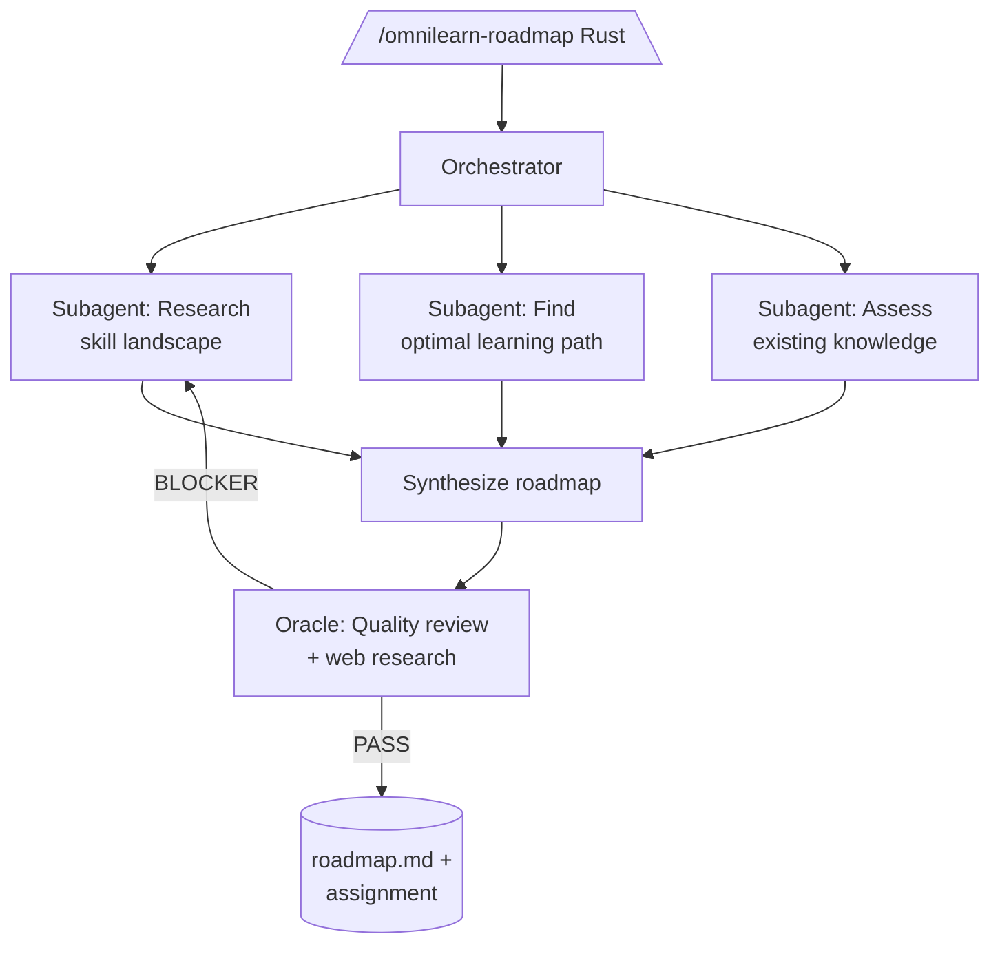

# OmniLearn

<p align="center">
  <a href="https://www.npmjs.com/package/omnilearn-workflow"></a>
  <a href="LICENSE"></a>
  <a href="https://www.npmjs.com/package/omnilearn-workflow"></a>
  <a href="https://github.com/BlackPool25/OmniLearn/stargazers"></a>
</p>

You type `/omnilearn-roadmap I want to learn Rust`. Three subagents wake up — one researches the Rust ecosystem, another digs up learning paths and common pitfalls, the third figures out what you already know and what you don't. Minutes later, you have a personalized roadmap and a hands-on assignment with tests, a scaffold, and a solution guide.

That's OmniLearn — multi-agent learning workflows for [OpenCode](https://opencode.ai).

```bash
npx omnilearn-workflow
```

Then in OpenCode:

```
/omnilearn-init
/omnilearn-roadmap I want to learn Rust
/omnilearn-start Rust
```

## What makes it different

Reading tutorials is the worst way to learn. You forget most of it, and you never hit the edge cases that teach you anything real. OmniLearn makes you write code instead.

- **Every topic gets a real assignment** — not a multiple-choice quiz, not a "repeat after me" tutorial. You get a problem description, a scaffold with the boring parts filled in, and a test suite that tells you when you're done.
- **Every assignment gets reviewed** — before you see it, an oracle subagent searches the web for current best practices and flags anything wrong, outdated, or misleading. BLOCKER issues get fixed before you waste time on bad content.
- **Stuck? You get a task, not more text** — instead of dumping another explanation on you, OmniLearn generates a focused micro-exercise that isolates exactly the concept you're struggling with.
- **It adapts to what you already know** — if you already shipped a FastAPI CRUD API, it won't make you do that again. It checks your existing skills and integrates them.

## Commands

| Command | What it does |
|---|---|
| `/omnilearn-init` | Choose where learning materials live |
| `/omnilearn-roadmap` | Research + generate a personalized roadmap |
| `/omnilearn-roadmap-edit` | Modify a roadmap without losing progress |
| `/omnilearn-start` | Start a hands-on learning session |
| `/omnilearn-refine` | Ask a deep question about a concept |
| `/omnilearn-research` | Multi-agent deep research on any topic |

Each command is a markdown file in `~/.config/opencode/command/`. They're plain text — read them, tweak them, own them.

## How it works



You type a command. The orchestrator spins up subagents in parallel — some research, some create content, one critically reviews the output before you see it. You get back a structured learning path with real assignments.

## Prerequisites

- **OpenCode** — `curl -fsSL https://opencode.ai/install | bash` (or `npx omnilearn-workflow` does it for you)
- **Oh-My-OpenAgent** — `bunx oh-my-openagent install` (required for multi-agent workflows)
- **Node.js >= 18**

Run `npx omnilearn-workflow --check` anytime to see what's missing.

## Installation

```bash
npx omnilearn-workflow
```

The installer copies the 6 command files to `~/.config/opencode/command/`, configures Context7 MCP for documentation lookups, and optionally sets up your learning directory.

Manual install if you prefer:

```bash
git clone git@github.com:BlackPool25/OmniLearn.git
cp packages/omnilearn-workflow/commands/*.md ~/.config/opencode/command/
```

## Project structure

```
OmniLearn/
├── README.md
└── packages/omnilearn-workflow/
    ├── package.json
    ├── bin/install.js          # npx installer
    └── commands/               # The actual workflows
        ├── omnilearn-init.md
        ├── omnilearn-roadmap.md
        ├── omnilearn-roadmap-edit.md
        ├── omnilearn-start.md
        ├── omnilearn-refine.md
        └── omnilearn-research.md
```

## Development

```bash
git clone git@github.com:BlackPool25/OmniLearn.git
cd OmniLearn/packages/omnilearn-workflow
npm install
cp commands/*.md ~/.config/opencode/command/
```

Edit the `.md` files, re-copy, test in OpenCode. Run `node test/test-install.mjs` before opening a PR.

## License

MIT
